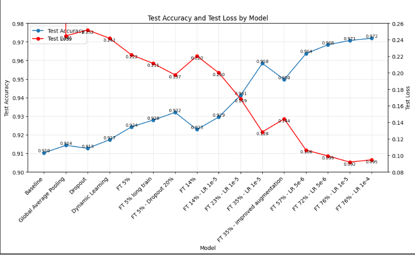
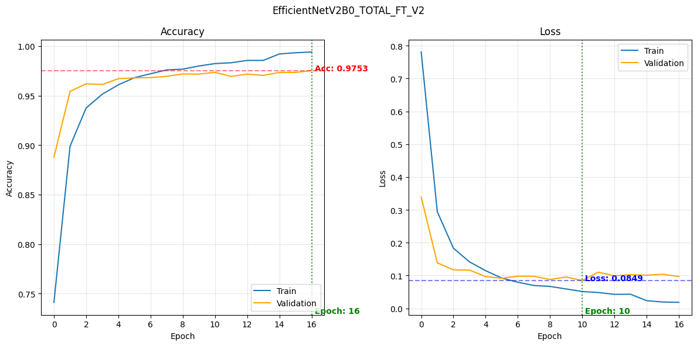
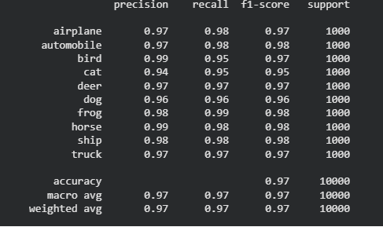
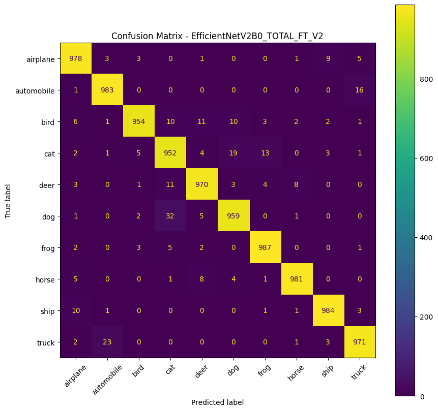

# CNN Image Classification Project

This project contains two Jupyter notebooks for image classification on the CIFAR-10 dataset. The work compares a custom convolutional neural network with transfer learning and fine-tuning using EfficientNetV2B0.

## Repository Description

This repository documents an end-to-end deep learning workflow for CIFAR-10 image classification. It includes model development from scratch, transfer learning experiments with a pretrained CNN architecture, training and validation analysis, final model evaluation, and visual performance reports.

The main goal is to compare the limitations of a custom CNN trained only on CIFAR-10 with the performance gains achieved through transfer learning. The project also explores how fine-tuning strategy, data augmentation, learning rate selection, and BatchNormalization handling affect final model quality.

## Key Findings

- Best custom CNN: `0.776` test accuracy and `0.700` test loss.
- Best transfer learning model: `EfficientNetV2B0_TOTAL_FT_V2` with `0.972` test accuracy and `0.095` test loss.
- Transfer learning improved test accuracy by approximately 19.6 percentage points compared with the best custom CNN.
- Fine-tuning approximately 76% of EfficientNetV2B0 with frozen BatchNormalization layers and a low learning rate gave the strongest overall result.

## Project Structure

```text
CNN_project/
├── images/
│   ├── accuracy_loss_evolution.png
│   ├── accuracy_loss_graph.png
│   ├── confusion_matrix.png
│   └── evaluation_report.png
├── notebooks/
│   ├── Custom_CNN.ipynb
│   └── EfficientNetV2B0_transfer_learning.ipynb
├── .gitignore
└── README.md
```

## Notebooks

| Notebook | Description |
| --- | --- |
| [Custom_CNN.ipynb](notebooks/Custom_CNN.ipynb) | Builds and evaluates CNN models from scratch using CIFAR-10. It includes data inspection, normalization, a baseline CNN, evaluation metrics, confusion matrices, and experiments with early stopping, dropout, additional convolutional layers, data augmentation, and dynamic learning rate scheduling. |
| [EfficientNetV2B0_transfer_learning.ipynb](notebooks/EfficientNetV2B0_transfer_learning.ipynb) | Uses EfficientNetV2B0 with ImageNet weights for transfer learning on CIFAR-10. It tests model-head changes, global average pooling, dropout, longer training with callbacks, data augmentation, and multiple fine-tuning strategies across EfficientNet blocks. |

## Dataset

Both notebooks use CIFAR-10 from TensorFlow/Keras:

```python
from tensorflow.keras.datasets import cifar10
```

CIFAR-10 contains 60,000 color images of size 32x32 across 10 classes:

`airplane`, `automobile`, `bird`, `cat`, `deer`, `dog`, `frog`, `horse`, `ship`, `truck`

## Environment

The notebooks are written for Google Colab and mount Google Drive:

```python
from google.colab import drive
drive.mount('/content/drive')
project_path = '/content/drive/MyDrive/CNN_project'
```

They create and use output folders under `project_path`:

```text
checkpoints/cnn1/
checkpoints/cnn2/
models/
metrics/
```

If running locally, remove or comment out the Colab Drive mount cell and update `project_path` to a local folder.

## Requirements

Recommended environment:

- Python 3.10+
- Jupyter Notebook or JupyterLab
- GPU runtime recommended for EfficientNetV2B0 experiments

Core Python packages used by the notebooks:

```bash
pip install jupyter numpy pandas matplotlib scikit-learn tensorflow
```

## How to Run

### Google Colab

1. Upload or open the notebooks from the `notebooks/` folder.
2. Select a GPU runtime.
3. Run the cells from top to bottom.
4. Keep the Google Drive mount cell enabled if you want models and metrics saved to Drive.

### Local Jupyter

1. Install the required packages.
2. Open Jupyter from the project root:

```bash
jupyter notebook
```

3. Open [Custom_CNN.ipynb](notebooks/Custom_CNN.ipynb) or [EfficientNetV2B0_transfer_learning.ipynb](notebooks/EfficientNetV2B0_transfer_learning.ipynb).
4. Remove or comment out the `google.colab` Drive mount cell.
5. Update `project_path` to a local path if you want to save models and metrics locally.

## Outputs

The notebooks save model and evaluation artifacts to the configured `project_path`:

- Trained Keras models: `models/N_*.keras`
- Custom CNN metrics: `metrics/N_metrics.csv`
- Transfer learning metrics: `metrics/N_TL_metrics_.csv`
- Training curves and confusion matrices are displayed inside the notebooks.

Generated model, metric, and checkpoint folders are intentionally not part of the repository because they can become large and are reproducible from the notebooks.

## Results

### Custom CNN

The custom CNN experiments showed steady improvement as the architecture became deeper and the training strategy was refined. The baseline model started with a test accuracy of `0.674`, while the best custom CNN configuration reached `0.776`.

| Model version | Test accuracy | Test loss |
| --- | ---: | ---: |
| Baseline | 0.674 | 0.984 |
| Early stopping | 0.687 | 0.938 |
| Dropout | 0.688 | 0.913 |
| 3 Conv2D layers | 0.715 | 0.870 |
| Data augmentation | 0.769 | 0.694 |
| Dynamic learning rate | 0.774 | 0.680 |
| 4 Conv2D layers | 0.776 | 0.700 |

The final selected custom CNN uses 4 convolutional layers and reaches a test accuracy of `0.776`. Its best validation accuracy is `0.7836`, with a final validation loss of `0.6777` after 44 epochs.

Data augmentation and deeper convolutional layers produced the strongest gains, suggesting that the model benefited from both improved generalization and increased feature extraction capacity. The dynamic learning rate version achieved the lowest test loss, while the 4 Conv2D layer model achieved the highest test accuracy.

### Transfer Learning with EfficientNetV2B0

Transfer learning with EfficientNetV2B0 substantially outperformed the custom CNN trained from scratch. The final fine-tuned model, `EfficientNetV2B0_TOTAL_FT_V2`, reached a test accuracy of approximately `0.972` with a test loss of `0.095`, showing strong generalization across the CIFAR-10 classes.



| Model stage | Test accuracy | Test loss |
| --- | ---: | ---: |
| Baseline | 0.910 | 0.245 |
| Global average pooling | 0.914 | 0.252 |
| Dropout | 0.913 | 0.242 |
| Dynamic learning | 0.917 | 0.222 |
| Fine tuning 5% | 0.924 | 0.211 |
| Fine tuning 5% long train | 0.928 | 0.197 |
| Fine tuning 5% dropout 20% | 0.932 | 0.220 |
| Fine tuning 14% | 0.923 | 0.200 |
| Fine tuning 23% | 0.941 | 0.169 |
| Fine tuning 35% | 0.958 | 0.128 |
| Fine tuning 57% improved augmentation | 0.950 | 0.144 |
| Fine tuning 57% | 0.964 | 0.106 |
| Fine tuning 72% | 0.968 | 0.099 |
| Fine tuning 76% | 0.971 | 0.092 |
| Fine tuning 76% final | 0.972 | 0.095 |

The transfer learning results improved as more of the pretrained network was made trainable. The strongest configurations were obtained by fine-tuning approximately 76% of the architecture while keeping BatchNormalization layers frozen and using a low learning rate. This provided a good balance between adapting the pretrained model to CIFAR-10 and preserving stable feature representations learned from ImageNet.

The final training curves show a validation accuracy of `0.9753` and a validation loss of `0.0849`. Training and validation performance remain close, which indicates that the final model generalizes well instead of simply overfitting the training set.



One likely reason fine-tuning helped is the difference between ImageNet and CIFAR-10. CIFAR-10 images are small, low-resolution `32x32` images, while EfficientNetV2B0 was originally trained on larger ImageNet images. The lower layers still provide useful generic visual features such as edges, textures, and contours, but deeper layers benefit from retraining so they can adapt to the simpler visual patterns in CIFAR-10.

Freezing BatchNormalization layers likely helped stabilize fine-tuning by preserving pretrained activation statistics. Combined with a low learning rate, this allowed the model to adapt gradually without severely damaging previously learned representations.

The classification report confirms consistent performance across nearly all classes, with overall accuracy, macro average, and weighted average around `0.97`.



| Class | Precision | Recall | F1-score |
| --- | ---: | ---: | ---: |
| Airplane | 0.97 | 0.98 | 0.97 |
| Automobile | 0.97 | 0.98 | 0.98 |
| Bird | 0.99 | 0.95 | 0.97 |
| Cat | 0.94 | 0.95 | 0.95 |
| Deer | 0.97 | 0.97 | 0.97 |
| Dog | 0.96 | 0.96 | 0.96 |
| Frog | 0.98 | 0.99 | 0.98 |
| Horse | 0.99 | 0.98 | 0.98 |
| Ship | 0.98 | 0.98 | 0.98 |
| Truck | 0.97 | 0.97 | 0.97 |

The confusion matrix shows that most predictions are concentrated on the diagonal. The largest remaining errors occur between visually similar classes, especially cats and dogs, and between trucks and automobiles. This is expected given the limited image resolution and overlapping visual characteristics of these categories.



Overall, EfficientNetV2B0 transfer learning increased test accuracy from `0.776` with the best custom CNN to `0.972` with the final fine-tuned model.

## Evaluation

Models are evaluated with:

- Accuracy
- Precision
- Recall
- F1 score
- Classification reports
- Confusion matrices

## Reproducibility Notes

The dataset is loaded directly from `tensorflow.keras.datasets.cifar10`, so no manual dataset download is required. Exact results may vary slightly between runs because neural network training depends on random initialization, data shuffling, hardware, and TensorFlow/CUDA runtime behavior.

The reported metrics in this README come from the saved experiment outputs and plots included in the `images/` folder.

## Limitations and Future Work

- CIFAR-10 images are only `32x32`, which makes visually similar classes difficult to separate.
- The final confusion matrix still shows residual errors between similar categories, especially cats and dogs, and trucks and automobiles.
- Future improvements could include stronger augmentation, higher-resolution inputs, additional regularization, or targeted error-reduction strategies for the most frequently confused class pairs.
